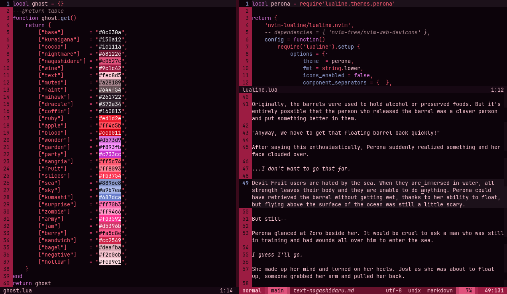

# perona.nvim

a colorscheme for neovim inspired by ghost princess perona from *one piece* with support for many mini.nvim modules, gitsigns, lsp, lualine, render-markdown, and trouble (so far!). built with [lush](https://github.com/rktjmp/lush.nvim/).

<div align="center">

</div>

- <a href="#palette">palette</a>
- <a href="#installation">installation</a>
- <a href="#extras">extras</a>
- <a href="#acknowledgments">acknowledgments</a>

this repository is mirrored to [github](https://github.com/sailorfe/perona.nvim) from [codeberg](https://codeberg.org/sailorfe/perona.nvim).

<a name="palette"></a>
## palette

| ansi                                  | bright                                |
| ------------------------------------- | ------------------------------------- |
|  `#281520`    |  `#683152`    |
|  `#a90f30`    |  `#de3557`    |
|  `#a75fb4`    |  `#de91da`    |
|  `#e65667`    |  `#eb8490`    |
|  `#8dafe2`    |  `#b4cff8`    |
|  `#b54067`    |  `#d65c85`    |
|  `#f269ad`    |  `#ff99cc`    |
|  `#b1819e`    |  `#f4b9dc`    |

<a name="installation"></a>
## installation

### pure lua

with lazy:

```lua
return {
	"sailorfe/perona.nvim",
	opts = {
		-- transparent = false,
		-- overrides = false,
	},
	init function()
		vim.cmd.colorscheme("perona")
	end,
}
```

### vimscript

the easiest method is probably just to run curl from your n/vim `colors` directory:

```sh
curl -LO https://codeberg.org/sailorfe/perona.nvim/raw/branch/vim/colors/perona.vim
```

then set colorscheme with one of the folowing:

- `init.lua`: `vim.cmd.colorscheme("perona")`
- `.vimrc`: `set colorscheme "perona"`
- the command  `:colorscheme perona`

<a name="extras"></a>
## extras

ports for the following can be found under [extras](https://codeberg.org/sailorfe/perona.nvim/src/branch/main/extras):

- alacritty
- foot
- iSH
- spotify_player
- termux
- tty

<a name="acknowledgments"></a>
## acknowledgments

- [evangelion.nvim](https://github.com/xero/evangelion.nvim) for entire chunks of lua and weeb inspiration
- [tokyonight.nvim](https://github.com/folke/tokyonight.nvim) for dir structure
