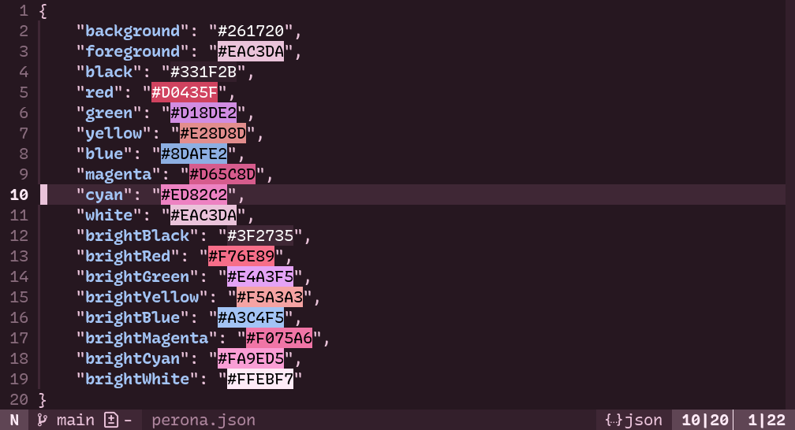

# perona.nvim

> ホロホロホロ!

a colorscheme for neovim inspired by ghost princess perona from _one piece_. built with [lush](https://github.com/rktjmp/lush.nvim).

<div align="center">

</div>

<!-- toc -->

- [palette](#palette)
- [features](#features)
- [installation](#installation)
  - [lua](#lua)
  - [vimscript](#vimscript)
- [contributing](#contributing)
  - [adding plugins](#adding-plugins)
  - [adding ports](#adding-ports)
- [acknowledgments](#acknowledgments)

<!-- tocstop -->

this repository is mirrored to [github](https://github.com/sailorfe/perona.nvim) from [codeberg](https://codeberg.org/sailorfe/perona.nvim).

## palette

|                                                                                                | key     | hex       |
| ---------------------------------------------------------------------------------------------- | ------- | --------- |
|     | base    | `#261720` |
|  | surface | `#331F2B` |
|  | overlay | `#3F2735` |
|     | text    | `#EAC3DA` |
|    | light   | `#FFEBF7` |
|   | mihawk  | `#D0435F` |
|   | garden  | `#D18DE2` |
|  | sangria | `#E28D8D` |
|  | kumashi | `#8DAFE2` |
|   | zombie  | `#D65C8D` |
|   | hollow  | `#ED82C2` |
|      | low     | `#31212A` |
|      | med     | `#48323F` |
|     | high    | `#5F4554` |

## features

- **supported neovim plugins**:
  - [gitsigns.nvim](https://github.com/lewis6991/gitsigns.nvim)
  - [indent-blankline.nvim](https://github.com/lukas-reineke/indent-blankline.nvim)
  - [mini.nvim](https://github.com/nvim-mini/mini.nvim) diff, statusline, and tabline
  - [render-markdown.nvim](https://github.com/MeanderingProgrammer)
  - [trouble.nvim](https://github.com/folke/trouble.nvim)
- **current ports** under `extras/`:
  - [alacritty](https://alacritty.org)
  - [foot](https://codeberg.org/dnkl/foot)
  - [rio](https://rioterm.com)
  - [termux](https://termux.dev)
  - `tty` for the console
  - [vim](https://www.vim.org)
  - [wezterm](https://wezterm.org)

## installation

### lua

with lazy:

```lua
return {
    "https://codeberg.org/sailorfe/perona.nvim",
--    init = function()
--        vim.cmd.colorscheme("perona")
--    end,
}
```

alternately, you can skip `init = function()` and declare `vim.cmd.colorscheme('perona')` somewhere in your `init.lua` after plugin load.

### vimscript

with vim-plug:

```vim
Plug 'https://codeberg.org/sailorfe/perona.nvim', { 'as': 'perona', 'branch': 'main' }
```

or you can place `colors/perona.vim` anywhere in your runtimepath:

```sh
curl -LO https://codeberg.org/sailorfe/perona.nvim/raw/branch/main/extras/vim/perona.vim
```

then set colorscheme with `colorscheme perona` either in your `vimrc` or temporarily with a command:

```vim
" .vimrc
set background=dark
syntax on
colorscheme perona
```

## contributing

```sh
git clone https://codeberg.org/sailorfe/perona.nvim
cd perona.nvim
```

make pull requests to [codeberg](https://codeberg.org/sailorfe/perona.nvim/pulls).

### adding plugins

**requires [lush](https://github.com/rktjmp/lush.nvim) and [shipwright](https://github.com/rktjmp/shipwright.nvim).**

1. `nvim lua/perona/lush.lua`
2. `:Lushify`
3. append new highlight groups to the bottom of the table
4. `./build.sh lua`

> [!WARNING]
> make sure you _do not_ have perona installed from this repository while developing. point neovim or your plugin manager to your local clone or else shipwright will get lost.

### adding ports

theme generation is helped by the `Makefile` at project root.

1. create `templates/$APP.*`:
   - for hex codes prefixed with hashes (`#ED82C2`), use `[[key]]`. examples: `alacritty.toml`, `wezterm.toml`.
   - for hex codes _without_ hashes (`ED82C2`), use `{{key}}`. examples: `foot.ini`, `tty.conf`.
2. add the output path `$APP/luna.*` to the `outputs` dictionary in `scripts/generator.py`.
3. (optional) ensure `palette.json` is up to date: `make palette`.
4. run the python script: `make generate`.

make pull requests to [codeberg](https://codeberg.org/sailorfe/perona.nvim/pulls).

## acknowledgments

- [evangelion.nvim](https://github.com/xero/evangelion.nvim) for weeb + `build.sh` inspiration
- [tokyonight.nvim](https://github.com/folke/tokyonight.nvim) for repository structure
