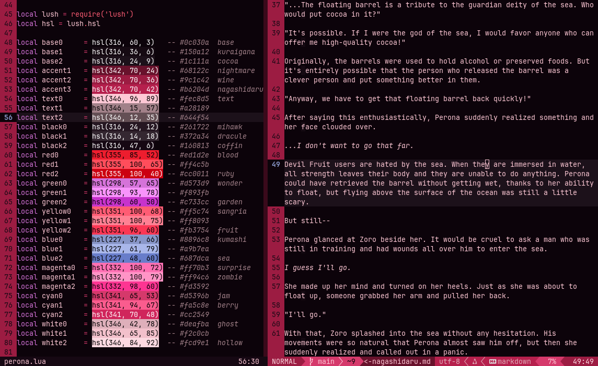

# perona.nvim

a colorscheme for neovim inspired by ghost princess perona from *one piece*. built with [lush](https://github.com/rktjmp/lush.nvim/).

## palette

+ base = `#0c030a` `#150a12` `#1c111a`
+ accent = `#62182f` `#932546` `#ab2b51`
+ text = `#fec8d5` `#a28189` `#644f54`
+ black = `#261722` `#372a34` `#160813`
+ red = `#ed1d2e` `#ff4c5b` `#cc0011`
+ green = `#d573d9` `#f893fb` `#c733cc`
+ yellow = `#ff5c74` `#ff8093` `#fb3754`
+ blue = `#8896c8` `#a9b7ea` `#687dca`
+ magenta = `#ff70b3` `#ff94c6` `#fd3592`
+ cyan = `#d5396b` `#fa5c8e` `#cc2459`
+ white = `#deafba` `#f2c0cb` `#fcd9e1`

## installation
