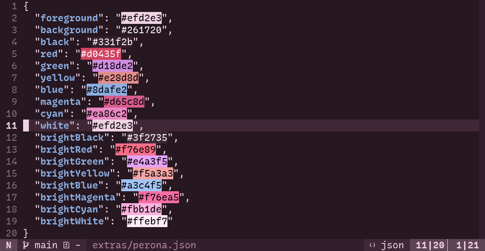

# perona.nvim

> ホロホロホロ!

a colorscheme for neovim inspired by ghost princess perona from _one piece_ with support for many [mini](https://github.com/nvim-mini/mini.nvim) modules, [gitsigns](https://github.com/lewis6991/gitsigns.nvim), lsp, [render-markdown](https://github.com/MeanderingProgrammer/render-markdown.nvim), and [trouble](https://github.com/folke/trouble.nvim) (so far!). built with [lush](https://github.com/rktjmp/lush.nvim/).

<div align="center">

</div>

<!-- toc -->

- [palette](#palette)
- [installation](#installation)
    * [lua](#lua)
    * [vimscript](#vimscript)
- [extras](#extras)
- [contributing](#contributing)
- [acknowledgments](#acknowledgments)

<!-- tocstop -->

this repository is mirrored to [github](https://github.com/sailorfe/perona.nvim) from [codeberg](https://codeberg.org/sailorfe/perona.nvim).

## palette

| key       | hex           |
| --------- | ------------- |
| base      | `#261720`     |
| surface   | `#331F2B`     |
| overlay   | `#3F2735` |
| text      | `#EAC3DA`    |
| light     | `#FFEBF7`   |
| mihawk    | `#D0435F`  |
| garden    | `#D18DE2`  |
| sangria   | `#E28D8D` |
| kumashi   | `#8DAFE2` |
| zombie    | `#D65C8D`  |
| hollow    | `#ED82C2`  |
| low       | `#31212A`     |
| med       | `#48323F`     |
| high      | `#5F4554`    |

## installation

### lua

with lazy:

```lua
return {
    "https://codeberg.org/sailorfe/perona.nvim",
--    init = function()
--        vim.cmd.colorscheme("perona")
--    end,
}
```

alternately, you can skip `init = function()` and declare `vim.cmd.colorscheme('luna')` somewhere in your `init.lua` after plugin load.

### vimscript

with vim-plug:

```vim
Plug 'https://codeberg.org/sailorfe/perona.nvim', { 'as': 'perona', 'branch': 'main' }
```

or you can place `colors/perona.vim` anywhere in your runtimepath:

```sh
curl -LO https://codeberg.org/sailorfe/perona.nvim/raw/branch/vim/colors/perona.vim
```

then set colorscheme with `colorscheme perona` either in your `vimrc` or temporarily with a command:

```vim
" .vimrc
set background=dark
syntax on 
colorscheme perona
```

## extras

there is an `extras/` directory with ports for

- [alacritty](https://alacritty.org)
- [foot](https://codeberg.org/dnkl/foot)
- [termux](https://termux.dev)
- `tty` for the console
- [wezterm](https://wezterm.org)

## contributing

theme generation takes the following steps:

- create `templates/$APP.*`:
    * for hex codes prefixed with hashes (`#ED82C2`), use `[[key]]` (examples: `alacritty.toml`, `wezterm.toml`).
    * for hex codes *without* hashes (`ED82C2`), use `{{key}}` (examples: (`foot.ini`, `tty.conf`).
- add the output path `$APP/perona.*` to the `outputs` dictionary in `generator.py`.
- ensure `palette.json` is up to date: `nvim --headless -c "luafile hex.lua" -c "qa"`.
- run `python3 generator.py`.

## acknowledgments

- [evangelion.nvim](https://github.com/xero/evangelion.nvim) for weeb + `build.sh` inspiration
- [tokyonight.nvim](https://github.com/folke/tokyonight.nvim) for repository structure
