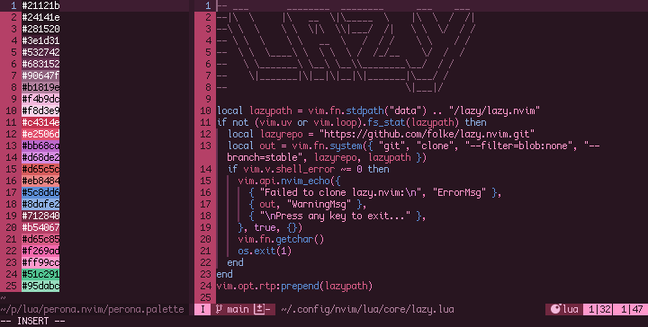

# perona.nvim

> ホロホロホロ!

a colorscheme for neovim inspired by ghost princess perona from *one piece* with support for many [mini](https://github.com/nvim-mini/mini.nvim) modules, [gitsigns](https://github.com/lewis6991/gitsigns.nvim), lsp, [render-markdown](https://github.com/MeanderingProgrammer/render-markdown.nvim), and [trouble](https://github.com/folke/trouble.nvim) (so far!). built with [lush](https://github.com/rktjmp/lush.nvim/).

<div align="center">

</div>

- <a href="#installation">installation</a>
- <a href="#extras">extras</a>
- <a href="#acknowledgments">acknowledgments</a>

this repository is mirrored to [github](https://github.com/sailorfe/perona.nvim) from [codeberg](https://codeberg.org/sailorfe/perona.nvim).

<a name="installation"></a>
## installation

### lua

with lazy:

```lua
return {
    "sailorfe/perona.nvim",
    dependencies = { "rktjmp/lush.nvim" },
    init = function()
        vim.cmd.colorscheme("perona")
    end,
}
```

### vimscript

the easiest method is probably just to run curl from your n/vim `colors` directory:

```sh
curl -LO https://codeberg.org/sailorfe/perona.nvim/raw/branch/main/colors/perona.vim
```

then set colorscheme with one of the following:

- `init.lua`: `vim.cmd.colorscheme("perona")`
- `.vimrc`: `set colorscheme "perona"`
- the command  `:colorscheme perona`

<a name="extras"></a>
## extras

there is an `extras/` dir with ports for

- `alacritty`, `ghostty`, `foot` and `wezterm`: what i alternate between in [my sway setup](https://codeberg.org/sailorfe/dots)
- `tty`: plain bash colors for the console

`perona.json` is included to in case you want to port this theme to whatever emulator you use. if you do, [please make pull request](https://codeberg.org/sailorfe/perona.nvim/pulls)!

<a name="acknowledgments"></a>
## acknowledgments

- [evangelion.nvim](https://github.com/xero/evangelion.nvim) for weeb inspiration
- [tokyonight.nvim](https://github.com/folke/tokyonight.nvim) for dir structure
